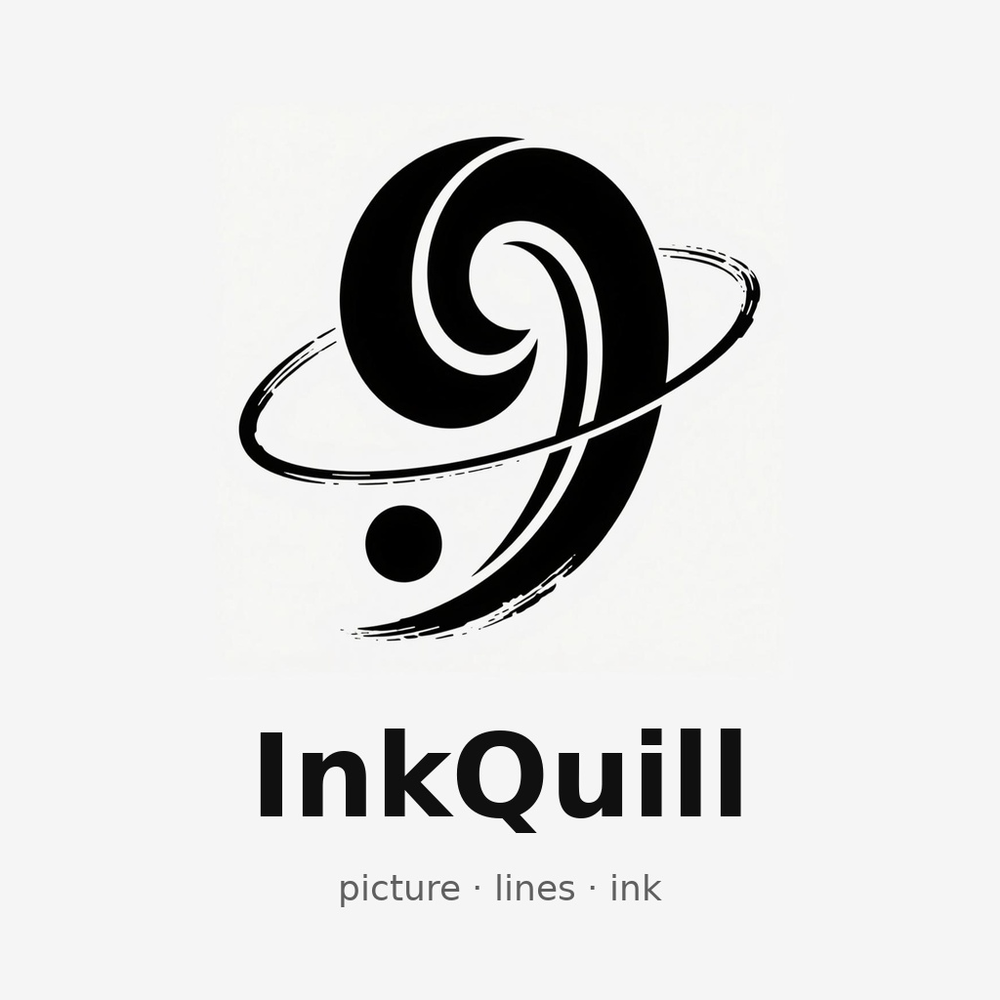

<p align="center">
  
</p>

<h1 align="center">InkQuill</h1>

<p align="center">
  <a href="README.md">简体中文</a> · <b>English</b>
</p>

> Turn a picture into a clean black-and-white line drawing.

InkQuill converts common raster images (PNG / JPG / JPEG / BMP / WEBP / TIF / TIFF)
into **white-background, black-line** line art — **still a bitmap, same format as the
input** (PNG in → PNG out, JPG in → JPG out).

It ships with a graphical interface: pick an image, tune the sliders, see a live
preview, and save or batch-convert — all with the mouse.

Use it for laser-cutting artwork, hand-drawn line art, simple sketches, stamps /
silhouettes, comic linework, or as an under-drawing for coloring.

> Sister project of [img2svg / InkLimner](https://github.com/HBrOcean): the same
> "extract the lines" idea, but that one outputs vector SVG. **InkQuill outputs a
> raster black-and-white line-art image instead, and includes a GUI.**

## Features

- **GUI** with pick → tune → live preview → save / batch, all by mouse
- **Background preview** — large images stay responsive (async processing)
- **One-click presets** — Photo line art / Crisp outline / Stamp / Scanned doc / Pencil
- **Four modes**
  - `lineart` — XDoG line extraction, the most hand-drawn look (default)
  - `edge` — Canny edges, outlines of objects
  - `binary` — pure black & white (stamps / silhouettes / comics)
  - `gray` — plain grayscale, keeps tonal depth
- **Three thresholding ways**: Otsu / manual / **adaptive** (scans, uneven lighting)
- **Two output colors**: **pure B&W** (clean lines) or **grayscale** (soft pencil look)
- **Smart denoise** (small-blob removal + morphological closing)
- **EXIF auto-rotate**, **whitespace trim**, **line thickening**
- **Batch processing** (multiprocessing on the CLI)
- **CJK / space-safe paths**, **large-image guard** (auto down-scale), **same output format**

## Install

Requires Python 3.8+.

```bash
pip install opencv-python numpy pillow
```

Or install as a command:

```bash
pip install .
inkquill --help
```

## Quick start

### GUI

```bash
python inkquill.py
```

### CLI

```bash
python inkquill.py image.png                       # -> image_lineart.png
python inkquill.py image.png -o out.png --mode edge
python inkquill.py scan.jpg --preset "扫描文档"
python inkquill.py photo.jpg --color gray --trim
python inkquill.py logo.png --mode binary --invert
python inkquill.py "*.jpg" -o out/
python inkquill.py folder/ -o out/                 # batch
```

Run `python inkquill.py --help` for the full option list.

## Modes

| Mode | Result | Best for |
|:--|:--|:--|
| lineart (XDoG) | black lines on white, strong stroke feel | photos → line art (default) |
| edge (Canny) | object outlines | crisp, hard-edged photos |
| binary | pure black & white | stamps, silhouettes, logos, comics |
| gray | keeps tonal depth | pencil-style base layer |

## Packaging (no-install builds)

PyInstaller cannot cross-compile: build the Windows EXE on Windows, the macOS `.app`
on macOS. Use the bundled `build.py`:

| OS | Command | Output |
|:--|:--|:--|
| Windows | `build.py` / `打包EXE.bat` | `dist\inkquill.exe` |
| macOS | `./build.sh` | `dist/inkquill.app` |
| Linux | `./build.sh` | `dist/inkquill` |

For all three at once, push a tag and let GitHub Actions
(`.github/workflows/build.yml`) build and upload artifacts for you.

## Development

```bash
pip install -e ".[dev]"
pytest -q
ruff check .
python inkquill.py --selftest
python inkquill.py --gui-selftest
```

## License

[MIT](LICENSE)
