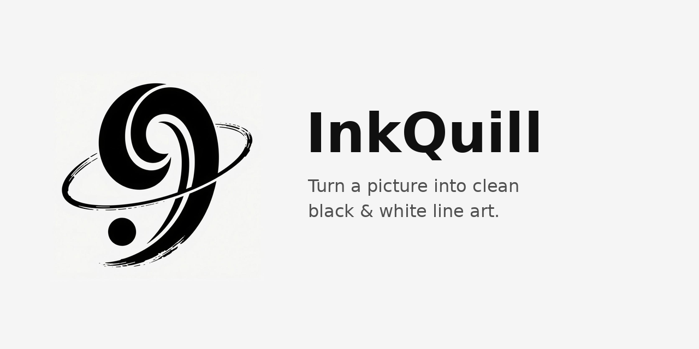

<p align="center">
  
</p>

<h1 align="center">InkQuill · 墨羽</h1>

<p align="center">
  <b>简体中文</b> · <a href="README.en.md">English</a>
</p>

> 把一张图，变成一笔干净的黑白线稿。

InkQuill 是一个**图片转黑白线稿图**的小工具：把 PNG / JPG / JPEG / BMP / WEBP / TIF /
TIFF 等常见位图，转成 **白底黑线** 的黑白线稿图——**还是位图，格式和输入一样**
（PNG 进 PNG 出、JPG 进 JPG 出）。

自带图形界面，选图、调参、实时预览、一键保存 / 批量处理，全部鼠标完成。

适合做：激光切割底图、手绘线稿、简笔画、印章 / 剪影、漫画线稿、上色底稿。

> 这是 [img2svg / InkLimner](https://github.com/HBrOcean) 的「位图版」兄弟项目：
> 同样是从图里「抽线」的思路，但那一个输出矢量 SVG，
> **InkQuill 直接输出黑白线稿位图，并带图形界面（PySide6 / Qt）**。

## ✨ 特性

- 🖼️ **图形界面**：选图 → 调参 → 实时预览 → 保存 / 批量，全程鼠标
- ⚡ **后台预览**：大图也不卡界面（异步处理，改参数即时刷新）
- 🎛️ **一键预设**：照片线稿 / 清爽描边 / 印章剪影 / 扫描文档 / 铅笔素描
- 🎯 **四种模式**
  - `手绘线稿 (XDoG)` —— 白底黑线，最像手绘描线（默认）
  - `轮廓描线 (Canny)` —— 勾勒物体边界
  - `黑白二值` —— 只有黑/白两色（印章 / 剪影 / 漫画感）
  - `灰度` —— 直接转灰度，保留明暗层次
- 🧾 **三种二值方式**：Otsu 自动 / 手动阈值 / **自适应阈值**（扫描件、光照不均）
- 🎨 **两种输出色彩**：**纯黑白**（干净纯线条）/ **灰度**（柔和，像铅笔稿）
- 🧹 **智能去噪**：简化剔碎点 + 闭运算补小缝
- 📱 **EXIF 方向校正**：手机照片不再横竖颠倒
- ✂️ **裁白边**：自动去掉四周空白（省料、方便对位）
- ➕ **线条加粗**：线太细易断时加粗
- 📦 **批量处理**：多选图片或整个文件夹，命令行自动多进程
- 🇨🇳 **中文路径**：兼容中文 / 空格文件名
- 🖥️ **大图防卡死**：自动降采样处理，再缩回原尺寸
- 🎯 **格式保持一致**：输出扩展名与输入相同，不改变你的工作流

## 📦 安装

需要 Python 3.8+。

```bash
pip install opencv-python numpy pillow
```

**pip 安装（获得 `inkquill` 命令）**：

```bash
pip install .
inkquill --help
```

> Windows 用户可直接双击 `启动.bat`：自动装依赖并打开界面。

## 🚀 快速开始

### 图形界面（推荐）

```bash
python inkquill.py      # 或双击 启动.bat
```

1. 点 **选择图片…**（可多选）
2. 顶部选个 **预设**（或手动挑模式、拖参数）
3. 右侧实时看 **原图 ↔ 结果** 对比
4. **保存当前…** 存这张，或 **批量处理全部…** 一次转换所有

### 命令行

```bash
# 默认手绘线稿，输出 原名_lineart.原格式 到原图同目录
python inkquill.py 图案.png

# 指定输出与模式
python inkquill.py 图案.png -o 线稿.png --mode edge

# 套用预设
python inkquill.py 扫描件.jpg --preset 扫描文档
python inkquill.py 照片.jpg --preset 照片线稿 --trim

# 灰度柔和线稿 + 裁白边
python inkquill.py 照片.jpg --color gray --trim

# 印章 / 剪影风（黑底图加 --invert）
python inkquill.py logo.png --mode binary --invert

# 批量：整个文件夹 → 输出目录（自动多进程）
python inkquill.py 图片文件夹/ -o 输出目录/

# 通配符
python inkquill.py "*.jpg" -o out/
```

## 📖 四种模式怎么选

| 模式 | 效果 | 适合 |
|:--|:--|:--|
| **手绘线稿 (XDoG)** | 白底黑线描边，线条感强 | 照片转手绘线稿、插画描线（默认首选） |
| **轮廓描线 (Canny)** | 勾勒物体边界 | 边缘清晰的照片、硬边物体 |
| **黑白二值** | 只有黑白两色 | 印章、剪影、logo、漫画、剪纸 |
| **灰度** | 保留明暗过渡 | 需要层次、当铅笔稿底的场景 |

> **纯黑白 vs 灰度**：`纯黑白` 输出只有 0 和 255，线条干净利落；
> `灰度` 保留浅灰过渡，边缘更柔和、更像铅笔稿。

## 🎛️ 一键预设

| 预设 | 说明 |
|:--|:--|
| 照片线稿 | 照片 → 柔和线稿（手绘线稿 + 灰度 + 轻微对比增强） |
| 清爽描边 | 线条清晰的纯黑白描边，适合描线 / 切割 |
| 印章剪影 | 二值化 + 去噪，印章 / 剪影 / logo |
| 扫描文档 | **自适应阈值**，专治扫描件、光照不均 |
| 铅笔素描 | 灰度铅笔感，当上色底稿 |

## 🔧 参数表

### 图形界面滑块

| 名称 | 说明（作用范围） |
|:--|:--|
| 细节 | 线稿细节丰富度 0~100（手绘线稿） |
| 加粗 | 线条加粗 0~3 |
| 柔化 | 预模糊去高频噪点 0~5（0/1 关闭） |
| 简化 | 去噪：剔除小于该面积的碎点，越大越干净（默认 15） |
| 阈值 | 二值化阈值 0~255（黑白二值，需关掉自动/自适应） |
| 自动阈值 | Otsu 自动选阈值 |
| 自适应阈值 | 适合扫描件 / 光照不均 |
| 边低 / 边高 | Canny 阈值（轮廓描线） |
| 对比 | 对比度 50~200（灰度 / 线稿灰度输出） |
| 反相 | 黑白反转，处理**黑底浅色图**时勾选 |
| 裁白边 | 去掉四周白边 |

### 命令行参数

| 参数 | 默认 | 说明 |
|:--|:--|:--|
| `inputs` | （必填） | 图片 / 目录 / 通配符，可多个 |
| `-o, --output` | 自动 | 输出文件（单张）或输出目录 |
| `--mode` | lineart | lineart / edge / binary / gray |
| `--color` | binary | binary（纯黑白）/ gray（灰度） |
| `--preset` | 无 | 套用预设（覆盖相关参数） |
| `--detail` | 0.7 | 细节丰富度 0~1（lineart） |
| `--dilate` | 0 | 线条加粗 0~3 |
| `--blur` | 0 | 预柔化去噪 0~5（0/1 关闭） |
| `--simplify` | 15 | 去噪：剔除小于该像素面积的碎点 |
| `--thresh` | 128 | 手动阈值（binary） |
| `--auto / --no-auto` | auto | binary 用 Otsu / 手动阈值 |
| `--adaptive` | 关 | binary 用自适应阈值 |
| `--canny-low / -high` | 40 / 120 | edge 模式阈值 |
| `--contrast` | 1.0 | 对比度 0.5~2.0 |
| `--invert` | 关 | 黑白反转（黑底图） |
| `--trim` | 关 | 自动裁白边 |
| `--margin` | 0 | 裁白边后额外留白像素 |
| `--suffix` | `_lineart` | 输出文件名后缀 |
| `--max-size` | 2400 | 处理分辨率最长边上限，0=不限 |
| `-j, --jobs` | 0 | 批量并发进程数，0=自动 |
| `-f / --no-overwrite` | 覆盖 | 覆盖已存在 / 跳过已存在 |
| `--version` | — | 版本号 |

### 输出规则

- 单张 + `-o` 以图片扩展名结尾 → 直接写该文件；
- 其余情况 → 输出到 `-o` 目录（未指定则原图目录），文件名 `原名_lineart.原格式`；
- **输出扩展名与输入保持一致**（PNG→PNG、JPG→JPG…）。
- JPG 有损，黑白线稿存 JPG 边缘可能发虚；要绝对干净请输出 PNG（`-o 线稿.png`）。

## 🔧 调参速查

| 想要的效果 | 怎么调 |
|:--|:--|
| 线太细、有断线 | 调大 **加粗**（或 `--dilate 1`） |
| 背景噪点多、碎点 | 调大 **简化**（或 `--simplify 30`）、**柔化** `--blur 2` |
| 细节丢失、变糊 | 调大 **细节** `--detail 0.9`，调小 **简化** |
| 想要更干净纯粹的黑白 | 输出色彩选 **纯黑白** |
| 想要柔和铅笔感 | 输出色彩选 **灰度** |
| 扫描件 / 光照不均 | 勾 **自适应阈值**（或 `--adaptive`） |
| 黑底图提取不到内容 | 勾 **反相**（或 `--invert`） |
| 二值图背景不干净 | 关掉自动阈值，手动拖 **阈值** 反复试 |
| 切割省料 | 勾 **裁白边**（或 `--trim`） |
| 大图处理卡 | 调小 `--max-size 1600` |

## 📦 打包成免安装程序

程序本身跨平台，但 PyInstaller **不支持交叉编译**——Windows 的 `.exe` 必须在
Windows 上打、macOS 的 `.app` 必须在 macOS 上打。用仓库里的 `build.py` 一键搞定：

| 系统 | 命令 | 产物 |
|:--|:--|:--|
| Windows | 双击 `打包EXE.bat`，或 `python build.py` | `dist\inkquill.exe` |
| macOS | `./build.sh`，或 `python3 build.py` | `dist/inkquill.app` |
| Linux | `./build.sh`，或 `python3 build.py` | `dist/inkquill` |

`build.py` 会自动装 PyInstaller、排除无关重库（体积 ~273MB → ~116MB）。

### 一次拿到三平台：GitHub Actions

仓库已带 `.github/workflows/build.yml`：推 tag 或手动触发，就在 Win / macOS / Linux
三个 runner 上各打一份并上传 Artifacts。

```bash
git tag v1.1 && git push origin v1.1
```

## ❓ 常见问题

**Q：转出来几乎是白纸 / 什么都看不到？**
A：多半是黑底浅色图被当成背景了——勾 **反相**；或调低 **简化**、调大 **细节**。

**Q：输出和输入格式一定要一样吗？**
A：默认一样。想换格式，把输出文件名写成想要的扩展名即可（如 `-o 结果.png`）。

**Q：JPG 输出线条边缘发虚？**
A：JPEG 有损压缩的正常现象，改输出 PNG 即可得到纯净黑白像素。

**Q：照片背景有很多碎点？**
A：那是照片本身的**纹理**（草地、树叶、砖墙…）。调大 **简化** / **柔化** 可压制；
主体清晰、背景简单的图（logo、插画、简笔画）效果最好。

**Q：支持哪些输入格式？**
A：`.png .jpg .jpeg .jfif .bmp .webp .tif .tiff`。

## 📁 项目结构

```
InkQuill/
├── inkquill.py                 # 主程序（单文件：算法 + 图形界面 + 命令行）
├── requirements.txt            # 依赖
├── pyproject.toml              # pip 安装 / inkquill 命令入口
├── Makefile                    # 常用开发命令
├── build.py / build.sh         # 跨平台打包
├── 启动.bat / 打包EXE.bat       # Windows 一键运行 / 打包
├── .github/workflows/build.yml # GitHub Actions 三平台云打包
├── examples/                   # 示例输入与输出
├── tests/                      # pytest 测试
└── README.md / README.en.md
```

## 🧪 开发与测试

```bash
pip install -e ".[dev]"
pytest -q          # 运行测试
ruff check .       # 代码检查
python inkquill.py --selftest       # 算法自检（无需界面）
python inkquill.py --gui-selftest   # 图形界面自检
```

## 📝 许可证

[MIT License](LICENSE) —— 可自由使用、修改、分发。
st   # 图形界面自检
```

## 📝 许可证

[MIT License](LICENSE) —— 可自由使用、修改、分发。
